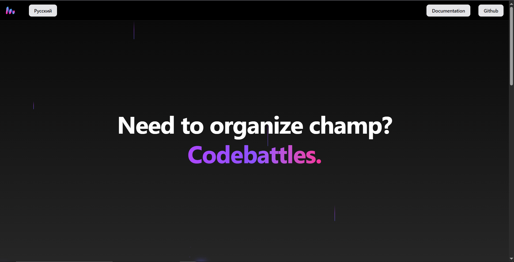
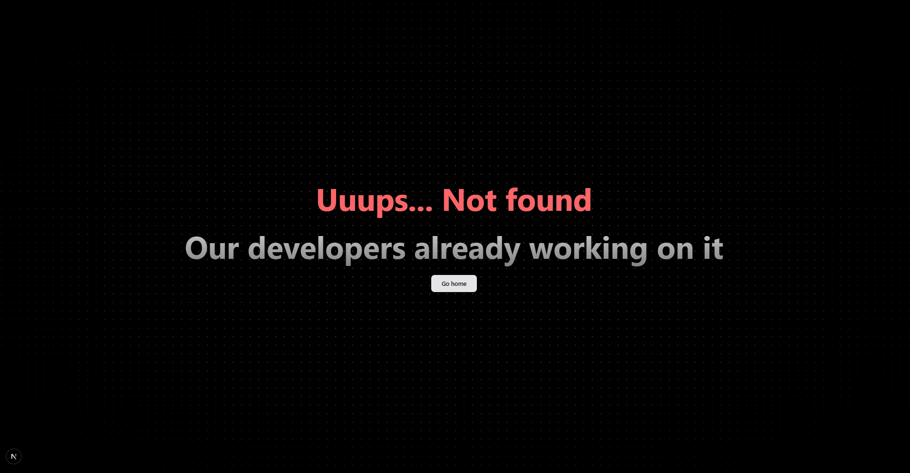

# Codebattles Landing


> 🔗 [codebattles.ru](https://codebattles.ru)  
> 🌐 Landing page for [Codebattles](https://github.com/codebattles-nn/codebattles) – a competitive programming platform.



---

## 🚀 Tech Stack

- **Next.js** – React framework for server-side rendering
- **Tailwind CSS** – utility-first CSS framework
- **Aceternity UI** – component library for beautiful UI

---

## 🌍 Localization

| Language | Status |
|----------|--------|
| 🇷🇺 Russian  | ✅ 100% |
| 🇺🇸 English  | ✅ 100% |

---

## 🛠 Development

This project uses **Yarn** as the primary package manager. You can also use `npm` if preferred.

### 📦 Install dependencies

```bash
yarn
